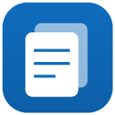

# Collections Plus

An open, local-first replacement for **Microsoft Edge Collections**, which is
being retired in Edge 149 (~June 2026). It's a small Manifest V3 browser
extension for **Chromium-based browsers** — no account, no server, no build
step. Your data stays in your browser.



## What it does

**Saving**

- **Side panel** that mirrors the original Collections pane.
- Save the **current page** (with thumbnail, favicon and title) with one click,
  or with the **`Ctrl+Shift+S`** keyboard shortcut (rebindable).
- **Right-click** any page, link, or image → *Save to Collections Plus ▸ pick a collection*
  (or create a new one on the spot). Select text → *Save selection as note*.
- **Add all open tabs** in the window to a collection at once.
- **Drag a link or image** straight onto the panel to save it.
- **Duplicate-aware** — saving a page already in the collection is skipped.
- When a page has no preview image, a **local screenshot** is captured as the
  thumbnail.

**Organizing**

- Free-form **notes**; **drag-and-drop reorder** of both items and collections.
- **Search** across every collection (titles, URLs, notes, tags).
- **Folders** to group collections, **pin** favorites to the top, and **tags**
  (click a tag to filter).
- **Checkboxes** turn any collection into a checklist; **custom fields**
  (price, qty, SKU…) add structured data that flows into exports.
- **Move or copy** items between collections; **undo** deletes.
- **Custom covers** — upload an image or promote a saved thumbnail with ★.
- **Light / dark theme**.

**Exporting & backup**

- **Export to Excel** as a real **`.xlsx`** workbook (one sheet per collection,
  clickable links) or as **CSV** — great for part lists, shopping lists, or
  anything you want to sort and total.
- **Export to Markdown or HTML**, or **copy a collection's links** to the
  clipboard.
- **Import your Edge export** (`collections_export.csv`) so your existing
  collections carry over on day one.
- **JSON backup** (high fidelity — keeps notes, images, fields) and a local
  **version history** you can roll back to.
- **Optional offline image caching** so saved images survive link rot.
- **Optional cross-device sync** through a single file you keep in any
  cloud-synced folder — see [Syncing across devices](#syncing-across-devices).

## Browser support

This is a standard Chromium Manifest V3 extension, so the core (context-menu
saving, storage, page capture, import/export) runs on any modern Chromium
browser. The catch is the **Side Panel API** (`chrome.sidePanel`), which hosts
the whole UI — its support varies:

| Browser | Side panel UI | Notes |
|---|---|---|
| **Google Chrome** (114+) | ✅ Full | Verified. |
| **Microsoft Edge** (114+) | ✅ Full | Verified. |
| **Brave** | ⚠️ Partial | Panel opens but a known bug can dismiss it after ~1s. |
| **Vivaldi** | ⚠️ Broken | Ships its own "Web Panels"; the standard API doesn't work. |
| **Opera** | ❌ No | Doesn't implement the extension Side Panel API. |
| **Arc / other Chromium** | ➖ Likely | Should work if built on Chromium 114+ with the Side Panel API. |

In short: **Chrome and Edge are the recommended, fully-tested targets.** Other
Chromium browsers may work depending on their Side Panel API support.

## Install (Load unpacked)

1. Open **`edge://extensions`** (or **`chrome://extensions`**).
2. Turn on **Developer mode** (toggle, usually bottom-left or top-right).
3. Click **Load unpacked** and select this folder (`C:\Code\Collections`).
4. Pin the **Collections Plus** icon to the toolbar and click it to open the panel.

To update after pulling changes, click the **reload** ↻ button on the
extension's card in `edge://extensions`.

### Keyboard shortcut

`Ctrl+Shift+S` saves the current page to the active collection. To change it,
open **`edge://extensions/shortcuts`** (or **`chrome://extensions/shortcuts`**)
and rebind *"Save the current page to Collections Plus."*

### Updating across devices

An unpacked extension does **not** auto-update — each browser keeps running the
code it last loaded until you hit **reload ↻** on its card. So whenever you pull
new code (or apply a fix), **reload the extension on _every_ device**, not just
one. This matters especially for sync: a device still running older code can not
only miss changes but also **push** with the old logic, so reload all of your
devices around the same time after an update. Reloading only reloads the *code* —
your collections and the sync file are untouched. (Publishing to the Chrome Web
Store / Edge Add-ons would enable background auto-updates; until then, reloading
per device is just how unpacked extensions work.)

## Migrating from Edge Collections

Before Collections is removed, open the Collections pane in Edge and click
**Export Your Data**. Edge writes `collections_export.csv` to your Documents
folder. Then in this extension:

> ⋯ (top-right) → **Import Edge CSV…** → choose `collections_export.csv`

The CSV only contains saved pages (Edge's export drops images and notes), so
the import is pages-only. Going forward, use **Export backup (JSON)** for a
complete backup.

## Organizing & exporting

### Reorder collections and items

Drag the **⠿ handle** on a collection card to reorder your list, and the handle
on an item to reorder it within a collection. The new order is saved instantly.

### Custom covers

Every collection has a cover thumbnail (the first saved item by default). To
change it:

- Open a collection and click **Change cover…** to upload your own image — it's
  downscaled and stored inline, so it always renders even if the original page
  goes offline.
- Or hover any saved page/image and click its **★** to promote that thumbnail to
  the cover.
- ⋯ → **Remove cover** clears it back to the default.

### Export to Excel (CSV)

- ⋯ (top-right) → **Export to Excel (CSV)** exports *every* collection.
- Inside a collection, ⋯ → **Export to Excel (CSV)** exports *just that one*.

The file opens straight in Excel / Google Sheets / Numbers — one row per item,
with columns **Collection, Type, Title, URL, Note, Added**. It's a UTF-8 CSV
(with a BOM) so accented characters and emoji survive. Handy for part lists,
shopping lists, research sources, or anything you want to sort, filter, or total
in a spreadsheet.

## Syncing across devices

Sync is **optional and provider-agnostic** — there's no account and no API keys.
Instead of integrating with one cloud (OneDrive vs. Google Drive vs. …), the
extension reads and writes a single `collections-sync.json` file that **you**
place inside a folder your computer already keeps synced — OneDrive, Google
Drive, Dropbox, iCloud Drive, etc. Your cloud client does the actual syncing;
the extension just keeps that one file up to date.

**On your first device:**

> ⋯ (top-right) → **Create sync file…** → save `collections-sync.json` inside
> your synced folder.

**On every other device:**

> ⋯ (top-right) → **Use existing sync file…** → open the *same*
> `collections-sync.json` once your cloud has finished downloading it.

The second step opens a normal **Open** dialog (not a save/overwrite prompt),
the device adopts the synced data, and it asks for permission to write so its own
future edits sync too.

### How it stays in sync

Two simple operations run against that one file:

- **Push** — when you change anything, a moment later the extension writes your
  collections to the file. Your cloud client carries the file to your other
  devices.
- **Pull** — the extension reads the file back and adopts it if it changed.
  An open panel checks **on focus, when it becomes visible again, and every ~20
  seconds**, so changes from another device show up on their own. **Sync now**
  and **Pull from sync file** force a push / pull immediately.

"Did the file change?" is decided by the file's **modification time as this
device sees it locally** — the timestamp your own filesystem records when the
cloud client drops in a new copy. Crucially, this does **not** depend on your two
computers' clocks agreeing, so a change made on one machine can't be mistaken for
"older" and skipped on another. (Earlier builds compared a clock value embedded
by the writing device, which could silently drop changes when clocks drifted —
that's fixed.)

### Conflicts & safety

Reconciliation is **last-write-wins**: whichever device writes the file *last*
is the version everyone converges on. That's exactly right for one person moving
between a laptop and a desktop. It is **not** built for two people (or two
offline devices) editing the *same* collection at once — if you edit on two
devices while both are offline, the one whose file syncs last wins and the
other's un-synced edits are overwritten. So let the cloud catch up before editing
elsewhere, and keep **Export backup (JSON)** as a guaranteed-complete snapshot.

When you connect a device to a file that already has data, it asks before doing
anything destructive — load the file (replace this device's data) or overwrite
the file with this device's data — so you can't accidentally clobber the good
copy. And if a device has **un-pushed local edits** when the file changes
elsewhere, it won't silently overwrite them — it keeps your changes and offers
*"Use file instead."* The sync menu shows when you last synced, and a local
**version history** (⋯ → *Version history…*) lets you roll back recent states.

> Requires a Chromium browser with the **File System Access API** (Chrome/Edge
> have it). If it's unavailable, the sync menu says so and the rest of the
> extension works unchanged.

## Data & privacy

Everything is stored locally via `chrome.storage.local` on your machine.
Nothing is sent to us or any server — the optional sync file lives in a folder
*you* chose, and only your own cloud client touches it. Saved page/image
thumbnails are stored as references to their original URLs (not copied), so they
display as long as the source stays online; **uploaded covers**, **captured
screenshots**, and **cached images** are downscaled and stored inline so they
always render. Offline image caching and cross-device sync are both **off until
you turn them on**.

## Project layout

```
manifest.json        MV3 manifest (+ keyboard command)
background.js        service worker: side panel, context menus, shortcut
sidepanel/           panel.html / panel.css / panel.js (the UI)
lib/store.js         data layer (chrome.storage.local), schema, settings, history
lib/csv.js           tolerant CSV parser + Edge-export mapper (pure, testable)
lib/export.js        collections → CSV + .xlsx sheet structures (pure, testable)
lib/render.js        collections → Markdown / HTML / link list (pure, testable)
lib/xlsx.js          dependency-free .xlsx writer (pure, testable)
lib/image.js         downscale a file/URL/screenshot into a small data URL
lib/sync.js          optional synced-file sync (File System Access API)
icons/               generated PNG icons
tools/make_icons.py  regenerate the icons
tools/test_*.mjs     pure-logic test harnesses (no browser needed)
fixtures/            sample Edge CSV for testing the importer
```

## Development

- No build step — edit files and hit reload on the extension card.
- Run the pure-logic tests without a browser:
  ```
  npm test            # csv import, csv/xlsx export, render, store/migrate
  ```
- Regenerate icons:
  ```
  python tools/make_icons.py
  ```

## License

[MIT](LICENSE) © Rod Trent. Use it, fork it, improve it.

## Roadmap ideas

- Bulk multi-select of items (move/copy/delete several at once).
- Full-text search ranking and per-collection search.
- Publishing to the Chrome Web Store / Edge Add-ons for background auto-updates.
